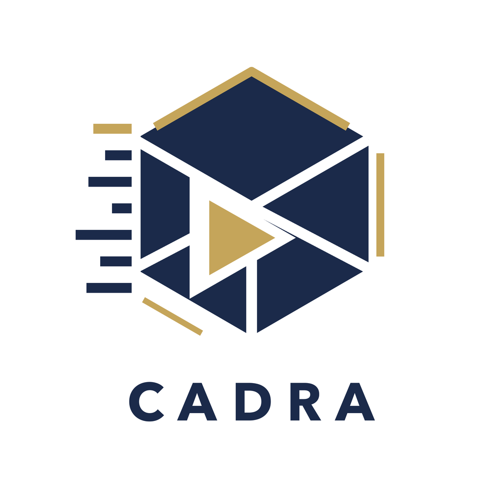
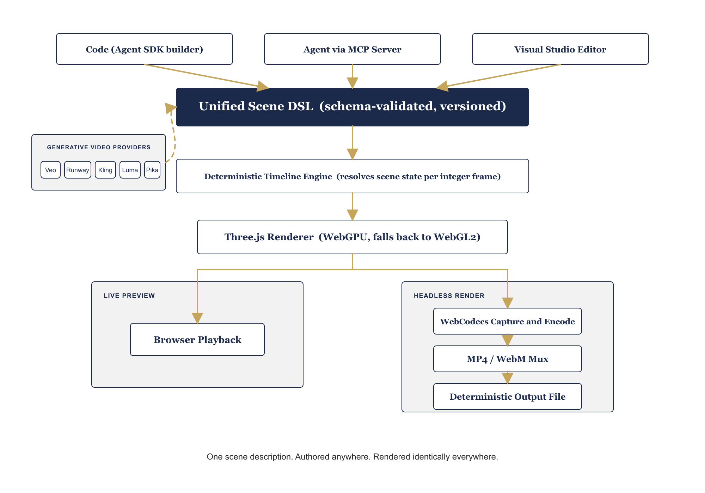

<p align="center">
  
</p>

<h1 align="center">Cadra</h1>

<p align="center">
  <b>A code-first, agent-first 3D video animation framework and studio, built on Three.js and WebGPU.</b>
</p>

<p align="center">
  <a href="#getting-started"></a>
  <a href="#getting-started"></a>
  <a href="#the-model-context-protocol-server"></a>
  <a href="#rendering"></a>
  <a href="LICENSE"></a>
</p>

---

Cadra gives you **one scene description** that works everywhere: write it in
code, generate or edit it through an agent over MCP, or build it visually in
the studio. That same description renders identically whether it is played
live in a browser over WebGPU or rendered headlessly, frame by frame, to a
deterministic MP4 or WebM file.

Every layer is built around that one idea. The scene document is a versioned,
schema-validated DSL. The timeline engine resolves it into a flat scene state
for any given integer frame, with no wall clock and no unseeded randomness
anywhere in the pipeline. The same resolved state drives a live WebGPU preview
in a browser tab and a byte-for-byte reproducible headless render on a
server, split across parallel workers when the render is long.

<p align="center">
  
</p>

## What's in the box

- **A deterministic scene DSL.** A `Project` of `Composition`s, each a fixed
  fps and integer frame count, made of tracks of clips, timeline transitions,
  keyframed properties with real easing curves, and a synced audio model.
  Validated by a Zod schema with a generated JSON Schema, a versioned
  contract, and diagnostics precise enough for an agent to self-correct from.
- **A real WebGPU renderer**, falling back to WebGL2, driving both a live
  in-browser preview (with transport controls, scrubbing, and frame-accurate
  seeking) and a headless capture path with byte-identical output.
- **A full render pipeline**: WebCodecs capture and encode, MP4/WebM muxing
  with audio, a Playwright-based server render worker, an experimental
  Chromium-free native GPU path, and a parallel frame-range orchestrator for
  long renders with per-range retry and resume.
- **An agent layer**: a fluent, typed scene builder; a self-describing schema
  and capability contract; and a Model Context Protocol server exposing scene
  authoring, rendering, asset management, and automatic repair of common
  validation errors as MCP tools and resources over stdio and HTTP.
- **Generative video ingestion**: a provider-agnostic interface with real
  adapters for Veo, Runway, Kling, Luma, and Pika, async generation jobs with
  placeholder frames and content-hash caching, and a one-step `add_generated_clip`
  MCP tool that composites the result straight into the timeline.
- **A visual studio**, built on the same DSL: an editable timeline with drag,
  trim, zoom, and undo; an inspector with a full keyframe editor; and
  viewport transform gizmos that stay in perfect sync with a live, editable
  JSON view of the document, because both are just views onto the same
  validated scene.

## Package map

| Package             | Responsibility                                                                             |
| -------------------- | ------------------------------------------------------------------------------------------- |
| `@cadra/core`       | Scene graph, deterministic clock, timeline engine, primitives, keyframes, interpolation, audio model, asset pipeline primitives |
| `@cadra/schema`     | Zod DSL mirroring `@cadra/core`, JSON Schema export, parser and diagnostics, capability manifest, self-describing contract |
| `@cadra/renderer`   | Three.js WebGPU/WebGL2 renderer, scene-graph reconciler, asset loaders                       |
| `@cadra/player`     | Live transport, embeddable preview, OffscreenCanvas worker, audio sync                        |
| `@cadra/encode`     | WebCodecs capture and encode, MP4/WebM muxing, browser-side headless render entry point       |
| `@cadra/headless`   | Deterministic headless render, Playwright server worker, experimental native GPU path, parallel render-job orchestration |
| `@cadra/agent-sdk`  | Fluent typed scene builder, provider-agnostic text-to-scene LLM adapter                       |
| `@cadra/mcp-server` | MCP server: scene, render, asset, repair, and generation tools over stdio and HTTP            |
| `@cadra/providers`  | Generative video provider adapters (Veo, Runway, Kling, Luma, Pika) and async generation jobs |
| `apps/studio`       | Visual editor: timeline, inspector, viewport gizmos, live DSL panel                            |
| `apps/cli`          | Command line render                                                                            |

## Getting started

```bash
pnpm install
pnpm -w build
pnpm -w test
pnpm -w lint
pnpm -w typecheck
```

This repository is a pnpm workspace managed with Turborepo. Packages live
under `packages/*` and applications live under `apps/*`, as described in the
package map above.

To run the visual studio locally:

```bash
pnpm --filter studio dev
```

A minimal scene, built entirely in code with the fluent builder:

```ts
import { scene, Text } from "@cadra/agent-sdk";

const document = scene({ id: "demo", name: "Demo Project" })
  .composition({ id: "main", name: "Main", fps: 30, durationInFrames: 90, width: 1920, height: 1080 })
  .add(Text({ id: "title", content: "Hello, Cadra" }).at(0, 90))
  .build();
```

The same `document` is valid input to `create_scene` over MCP, and opens
directly in the studio.

## Documentation

- [Agent authoring guide](docs/agent-authoring-guide.md): how to author a
  valid Cadra scene as an LLM agent or a developer.
- [Diagnostic codes](docs/diagnostic-codes.md): every validation diagnostic
  code, what it means, and whether it carries an automatic repair patch.
- [Provider capabilities](docs/provider-capabilities.md): what each
  generative video vendor's adapter actually supports, verified against real
  documentation.
- [Architecture decision records](docs/adr): larger design decisions, with
  their context and tradeoffs.

## License

Apache License 2.0. See [LICENSE](LICENSE).

---

<p align="center"><sub>Mohamed Yasser | Solutions Architect</sub></p>
